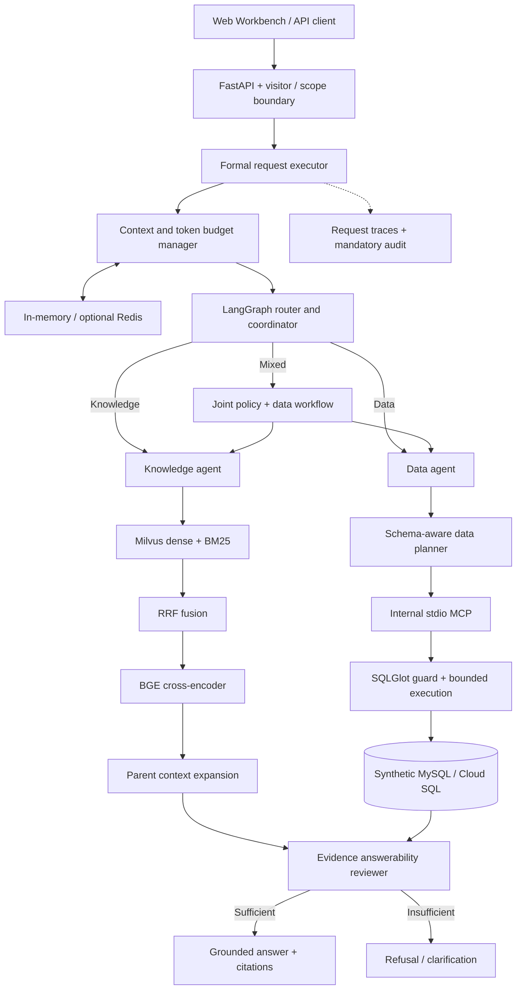
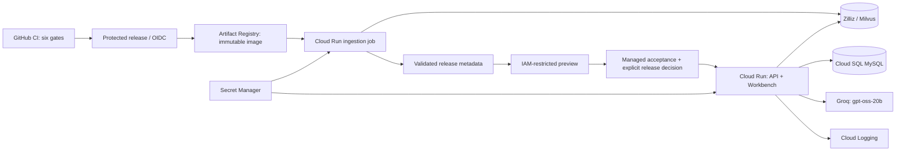

<div align="center">


# NexusAgent

### Enterprise Autonomous Multi-Agent Decision Intelligence Platform

**Evidence-grounded Hybrid RAG × MCP NL2SQL × LangGraph orchestration**

*Turn enterprise policies and operational data into decisions you can inspect.*

<p>
  <a href="https://github.com/Akgithub2028/NexusAgent-Enterprise-Autonomous-Multi-Agent-Decision-Intelligence-Platform/actions/workflows/ci.yml"></a>
  <a href="LICENSE"></a>
  <a href="#local-quickstart"></a>
  <a href="#cloud-deployment"></a>
</p>
<p>
  <a href="#system-architecture"></a>
  <a href="#mcp-data-agent--safe-nl2sql"></a>
  <a href="#clause-aware-hybrid-rag-pipeline"></a>
  <a href="#clause-aware-hybrid-rag-pipeline"></a>
  <br />
  <a href="#mcp-data-agent--safe-nl2sql"></a>
  <a href="#distributed-tracing--context-management"></a>
  <a href="#production-asgi-runtime"></a>
  <a href="#cloud-deployment"></a>
</p>

<!-- VERIFIED_LIVE_BADGE -->

**[Highlights](#key-engineering-highlights)** · **[Architecture](#system-architecture)** · **[Workbench](#interactive-web-analytics-workbench)** · **[Benchmarks](#retrieval-benchmark-v2-results)** · **[Quickstart](#local-quickstart)** · **[Deployment](#cloud-deployment)** · **[Docs](#documentation-map)**

| 200 benchmark scenarios | 96.25% Child Hit@1 | 28/28 security cases | 3 agent routes |
| :---: | :---: | :---: | :---: |
| 160 answerable · 40 unanswerable | 154/160 after reranking | Frozen boundary evaluation | Knowledge · Data · Mixed |

</div>

> **Deployment status:** P0–P7 implementation is prepared. Live acceptance is pending: project billing is disabled, and managed provisioning, ingestion and cloud measurements remain unfinished. Release automation defaults to disabled. A live badge will appear only after verified public HTTPS acceptance. See the [phase ledger](docs/deployment/README.md).

## The problem NexusAgent solves

Inventory replenishment, discount approvals, warranty validation and financial risk
assessment often require both policy clauses and database facts. NexusAgent combines
those sources in one bounded decision workflow, with citations such as `[E1]` and
`[D1]`, observable execution stages and explicit insufficient-evidence outcomes.

It addresses four recurring failure modes:

- **Missing fine print:** clause-aware parent/child chunks retain exceptions and policy hierarchy.
- **Invented or unsafe SQL:** schema discovery, table/column scopes, SQLGlot validation and a read-only database identity constrain queries.
- **Unsupported recommendations:** evidence sufficiency and citation checks govern answer release.
- **Context drift and shared history:** bounded context and tenant/visitor-owned session keys keep conversations scoped.

The system is designed to reduce unsupported answers and fail closed at its boundaries.
Its measured results apply to synthetic fixtures and recorded evaluations; they are
not a guarantee of zero hallucinations or a production security certification.

## Key engineering highlights

| Capability | What makes it inspectable |
| :--- | :--- |
| **LangGraph multi-agent orchestration** | Explicit router, planner, skill/tool and reviewer transitions; Pydantic v2 contracts; bounded failure outcomes. |
| **Clause-aware hybrid RAG** | Dense + lexical recall, RRF, cross-encoder reranking, stable clause markers and parent expansion. |
| **MCP data access** | Runtime-owned installed stdio client/server, discovered schemas and guarded SQL; protocol-only child stdout. |
| **Evidence release** | Sufficiency review, citation/reference checks and structured abstention when evidence is inadequate. |
| **Scoped memory** | Optional Redis or bounded in-memory sessions, TTL, version checks, deduplication and rolling summaries. |
| **Cloud boundary** | Non-root CPU image, offline pinned models, immutable corpus manifests, separate ingestion, restricted preview and OIDC release gates. |

## System architecture



### Advanced technology stack

| Tier | Technologies | Responsibilities |
| :--- | :--- | :--- |
| Orchestration | LangGraph, LangChain Core, Pydantic v2 | State graphs, structured model output and skill/tool contracts. |
| Dense retrieval | Milvus, BAAI `bge-small-zh-v1.5` | CPU embeddings, 512-dimensional normalized COSINE search; local HNSW / managed AUTOINDEX. |
| Lexical ranking | BM25, RRF, BAAI `bge-reranker-base` | Keyword recall, rank fusion and CPU cross-encoder precision. |
| Data tools | MCP, SQLGlot, SQLAlchemy, PyMySQL | Schema discovery, SELECT validation, scope checks, row limits and bounded driver waits. |
| Context / memory | Token budgets, in-memory store, optional Redis | Visitor/tenant isolation, TTL, optimistic versions and optional summaries. |
| Serving | FastAPI, Uvicorn, package-local HTML/JS | One application serves both API and Workbench; one cloud worker. |
| Deployment | Docker, Cloud Run, Cloud SQL, Zilliz, Secret Manager, GitHub OIDC | Prepared infrastructure and gated release automation; managed acceptance pending. |

## Clause-aware hybrid RAG pipeline

```text
Documents → clause-aware parents / children → BGE embeddings
                                         ↘ Milvus dense search
Query ────────────────────────────────────↗                  ↘
                       BM25 lexical search ─────────────────→ RRF
                                                               ↓
                                                       BGE cross-encoder
                                                               ↓
                                                       Parent expansion
                                                               ↓
                                                   Evidence + answerability review
```

The serving corpus contains **12 documents, 36 parents and 101 children**. Stable
clause identifiers preserve document hierarchy; child hits expand into parent policy
context rather than isolating an exception from its rule. BM25 and vector records
must agree on exact child IDs. Cloud releases pair these local assets with a versioned
remote collection and the same model revisions. Serving never creates or ingests a
collection; an explicit writer job owns those operations.

Frozen clause-aware benchmark variants are retained separately from the baked serving
corpus. Their artifact hashes and adoption decisions remain unchanged.

## MCP data agent & safe NL2SQL

The Data Agent discovers approved schemas through MCP, plans an SQL query, validates
its AST and executes it through SQLAlchemy/PyMySQL. The boundary enforces:

- SELECT-only behavior, with mutation/DDL and disallowed constructs rejected.
- `DataScope` table and column allowlists, bounded rows/cells and LIMIT handling.
- Connection, pool, query and MCP timeouts; cloud transport uses an explicit SQL socket.
- A read-only SQL identity restricted to `products`, `inventory_snapshots`, `purchase_orders` and `suppliers` for the public synthetic demo.

AST checks and database privileges are independent defenses. Timeouts are driver and
application controls; the README does not claim that a SQL hint alone cancels every
server-side operation. MCP stays inside the application runtime rather than becoming
an extra public service.

## Distributed tracing & context management

Request traces record stage status and timing across routing, retrieval, reranking,
MCP and synthesis. The Workbench displays safe trace projections. Cloud stdout logs
carry release, corpus and revision identifiers; mandatory audit uses explicit failure
semantics and payload-free events. These are structured application traces, not a
claim of an installed OpenTelemetry exporter or globally tamper-proof cloud logging.

Memory supports `disabled`, `in_memory` and `redis`. The cloud v1 configuration uses
**ephemeral in-memory history**, bounded to **1,000 sessions**; TTL, turn limits,
idempotency and optimistic versions remain enforced. Optional rolling summaries run
after successful persistence when configured turn thresholds are reached. Redis is
supported in code, but is not included in current Compose or the initial cloud plan.

## Production ASGI runtime

FastAPI owns runtime startup/cleanup and serves `/`, `/assets`, `/health`, `/ready`
and `/api/v1/agent/execute`. The cloud launcher binds `0.0.0.0:$PORT`. Public-demo mode
uses fixed synthetic scopes, signed Secure/HttpOnly/SameSite=strict visitor cookies
and an exact HTTPS Origin. Private mode rejects execution by default; the local adapter
remains loopback-only.

The prepared configuration uses a **240-second cooperative execution deadline** below
a **300-second HTTP timeout**. Native model calls remain serialized even after an
awaiting request is cancelled; running CPU work cannot be forcibly stopped by asyncio.
Quotas and one-instance settings are process/resource controls, not a guaranteed global
spending cap. Readiness reflects bootstrap and registered checks, not continuous proof
that every remote dependency is healthy.

## Interactive Web Analytics Workbench

<div align="center">
  
  <p><em>The existing Workbench: scoped multi-turn interaction, route/status indicators, citations and request-stage telemetry.</em></p>
</div>

Ask knowledge, operational data or mixed questions from the same interface. Inspect
answer citations and the execution trace, continue a session or reset it. Public-demo
users receive distinct visitor identities and an explicit warning that history may
expire or disappear on restart. FastAPI serves the UI directly—no separate frontend
hosting is needed.

## Retrieval Benchmark v2 results

The frozen benchmark contains **200 synthetic enterprise scenarios** across **12
long-form policies**: **160 answerable** and **40 unanswerable**. Ranking denominators
below are the 160 answerable queries.

| Metric | RRF baseline: dense + sparse | BGE cross-encoder reranker | Improvement |
| :--- | :---: | :---: | :---: |
| **Child Hit@1** | 85.62% · 137/160 | **96.25% · 154/160** | **+10.63 pp** |
| **Child Hit@5** | 100.00% · 160/160 | **100.00% · 160/160** | Both cover all answerable queries |
| **MRR@5** | 91.69% · 146.7/160 | **98.12% · 157.0/160** | **+6.44 pp** |

Unanswerable cases are recorded separately; answerable Hit@K is not a refusal-accuracy
metric. Rounded percentage-point gains come from unrounded scores. Verify the
[committed metrics](artifacts/public-evaluation/retrieval-v2/metrics.json) and
[evaluation methodology](docs/EVALUATION.md) without downloading models or calling an LLM.

## Engineering rigor & CI pipeline

The [verified P6 CI snapshot](https://github.com/Akgithub2028/NexusAgent-Enterprise-Autonomous-Multi-Agent-Decision-Intelligence-Platform/actions/runs/37143083491)
passed **1,930 unit tests**, **323 offline integration tests** and **28/28 security
cases**. Security cases overlap the unit suite; these counts are not additive.
The current CI badge links to the latest run.

| Quality gate | What it verifies |
| :--- | :--- |
| Quality | Ruff lint/format, dependency lock, pip consistency, Compose, frozen evidence and JS syntax. |
| Unit | State machines, AST guards, context budgets, serialization, security and cloud boundaries. |
| Offline integration | Deterministic substitutes for external I/O and graph/protocol contracts. |
| Security evaluation | Recorded tenant/scope, guarded SQL and release-boundary cases. |
| Secret scanning | Repository secret detection with narrowly scoped checksum exceptions. |
| Dependency audit | Known dependency vulnerabilities under the recorded audit conditions. |

Offline test/evidence execution needs no provider keys. Package installation,
vulnerability databases, model builds and cloud releases require networking. Pydantic
checks runtime schemas; it is not a substitute for a static type checker.

<details>
<summary><strong>Historical counts preserved from the original README</strong></summary>

The pre-P0 README reported **1,802 unit tests** and **235 offline integration tests**.
P0's audited baseline recorded **1,806** and **235**; subsequent phases expanded coverage.
Use the linked CI run for current verified results, not the older marketing snapshot.

</details>

## Local quickstart

### A. Evidence verification without provider keys

Python **3.11+** is supported; the cloud image targets Linux amd64 / Python 3.11.
Dependency installation requires network access, while the verifiers run offline.

```bash
git clone https://github.com/Akgithub2028/NexusAgent-Enterprise-Autonomous-Multi-Agent-Decision-Intelligence-Platform.git
cd NexusAgent-Enterprise-Autonomous-Multi-Agent-Decision-Intelligence-Platform
python3 -m venv .venv
source .venv/bin/activate  # Windows: .venv\Scripts\Activate.ps1
pip install -r requirements.lock
pip install -e . --no-deps
python scripts/verify_retrieval_evidence.py
python scripts/verify_retrieval_v2_evidence.py
```

Run `pytest -q tests/unit` or `pytest -q -m offline_integration` for regression checks.
Dependency installation and runtime checks depend on your machine and available caches.

### B. Full local runtime and Workbench

```bash
cp .env.example .env
# Fill the OpenAI-compatible provider fields and local infrastructure credentials.
docker compose up -d
# Wait for MySQL / Milvus / etcd / MinIO to be healthy.
python scripts/initialize_knowledge_corpus.py
python scripts/run_local_demo.py knowledge
python scripts/run_local_demo.py data
python scripts/run_local_demo.py mixed
python scripts/run_local_web_demo.py mixed
```

Open **http://127.0.0.1:8000**. Compose starts infrastructure; it does not package the
application or launch Redis. See the [local run guide](docs/LOCAL_DEMO.md) for audit
paths, scopes and prerequisites. Local demo launchers must not be exposed publicly.

## Cloud deployment



Prepared for `nexus-agent-510512` / `us-west1`, alongside Zilliz `gcp-us-west1`.
The image contains pinned CPU BGE models and the exact local corpus. Google Terraform
and release tooling separate relational/vector state from serving, use numeric secret
versions, and keep ingestion under a separate writer identity. CI uses short-lived
OIDC credentials and a serialized release queue; a separate restricted preview remains
private after production becomes public.

Candidate settings are **2 vCPU, 4 GiB RAM, concurrency 2, minimum 1 and maximum 1 instance**. The owner chose one warm
instance; these settings await cloud measurements. The **$50/month alert target** is
an operator planning value, subject to billing currency/pricing—not a spending cap.

P0–P3 are validated locally; P4–P7 code and runbooks are implemented, while managed
acceptance remains pending. `LIVE_ACCEPTANCE.json` is deliberately blocked and release
automation is disabled. There is no verified live URL to advertise yet.

**Start here:** [deployment ledger](docs/deployment/README.md) ·
[P7 release runbook](docs/deployment/P7_RELEASE.md) ·
[infrastructure and operators](deploy/cloud-run/README.md) ·
[next-session handoff](docs/CODEX_HANDOFF.md).

## Repository structure

```text
.github/workflows/         Six CI gates + disabled-by-default OIDC release workflow
deploy/                   Cloud infrastructure, federation and nonsecret config examples
src/decision_agent/
  api/                    FastAPI transport, identity and admission boundaries
  application/            Formal executor, runtime lifecycle and preflight
  agents/                 Planners, evidence selectors and reviewers
  context/ + memory/      Token budgets, scoped session state and summaries
  ingestion/              Document parsers, clause-aware chunks and explicit cloud job
  retrieval/              Milvus, BM25, RRF, BGE and parent expansion
  data/ + mcp_client/     SQL planning/guards and installed stdio MCP
  mcp_server/             Schema and guarded query tools
  security/               Scope, provider governance and mandatory audit
  skills/                 Knowledge, data and mixed decision skills
  web/                    Package-local HTML/CSS/JS Workbench
datasets/                 Synthetic enterprise fixtures and frozen evaluations
docs/                     Architecture, phase evidence, runbooks and assets
docker/                   Infrastructure initialization, including MySQL seed scripts
scripts/                  Demo, verification, deployment and release commands
tests/                    Unit, offline integration and opt-in live/e2e scenarios
```

## Documentation map

| Guide | Read it for |
| :--- | :--- |
| [Architecture](docs/ARCHITECTURE.md) | Component topology, lifecycle and execution paths. |
| [Agent workflow](docs/AGENT_WORKFLOW.md) | Router, planner, skills, tools and reviewer contracts. |
| [Hybrid RAG](docs/HYBRID_RAG.md) | Dense/lexical retrieval, RRF, reranking and parent expansion. |
| [Data Agent & MCP](docs/DATA_AGENT_AND_MCP.md) | SQL planning, guarded MCP tools and MySQL privileges. |
| [Security boundaries](docs/SECURITY_BOUNDARIES.md) | Scope ownership, provider governance and audited release. |
| [Evaluation](docs/EVALUATION.md) | Frozen metrics, denominators and verification commands. |
| [Local demo](docs/LOCAL_DEMO.md) | Working installation and Workbench commands. |
| [Engineering decisions](docs/ENGINEERING_DECISIONS.md) | Trade-offs and deferred capabilities. |
| [Deployment ledger](docs/deployment/README.md) | P0–P7 implementation versus managed acceptance. |
| [Directory index](docs/deployment/DIRECTORY_INDEX.md) | Maintained directory maps and source fingerprints. |

## License

Licensed under **Apache 2.0**. See [LICENSE](LICENSE). Packaged BGE models retain their
upstream MIT license notices and pinned revisions in the release manifest.
