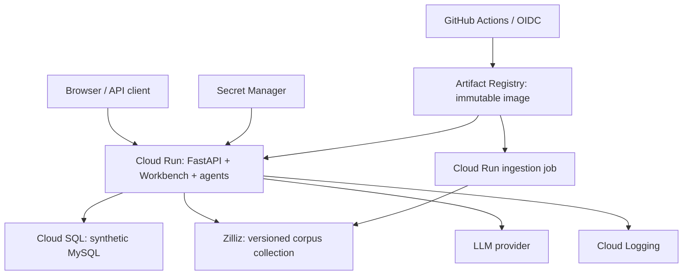

# NexusAgent Cloud Run implementation plan

Source baseline: `2e2b34c220158c1711409ddb1335fba00fbe375f`, reviewed 2026-10-03.
P0–P2 are complete. P3–P7 remain planned work; stop before P3 for the owner's instruction.
The [audit](P0_AUDIT.md) distinguishes implemented behavior from proposed changes;
the [baseline](P0_BASELINE.json) records checks performed on this checkout.

## Target

Deploy one container for FastAPI, the existing Workbench, LangGraph, CPU BGE retrieval,
review and the internal stdio MCP client/server. Externalize synthetic MySQL data to
Cloud SQL and vectors to Zilliz. Package BM25 input and parent metadata locally in the
same immutable release as the vectors. Run knowledge ingestion as a separate job.
Use Secret Manager, Cloud Logging, Artifact Registry and GitHub Actions with OIDC.

V1 uses ephemeral visitor-isolated in-memory sessions. Redis is deferred until durable
or cross-instance history is required. The public site will describe itself as a
synthetic-data demo; add a live badge only after verifying its actual HTTPS URL.

## Decisions from the audit

| Proposal | Implementation decision |
| --- | --- |
| Create a production runtime from scratch | Reuse `decision_agent.main`, `api.runtime` and `application.configured_runtime`; add a public-demo composition boundary. |
| One anonymous user for everyone | Fixed tenant and grants, but a distinct signed visitor identity for session ownership. |
| Managed Milvus is an endpoint switch | Add explicit AUTOINDEX support and separate collection provisioning from serving. Existing adapter permits only HNSW. |
| Cloud SQL can use existing hostname settings | Add a validated Unix-socket connection option and propagate it into the MCP child environment. |
| Run ingestion separately | Already true for chunk upserts. Serving still creates missing collections and must become a reader-only path. |
| Download models during image build | Retain existing model revision pins; add reranker offline loading controls and a CPU dependency strategy. |
| One instance makes memory reliable | History remains ephemeral across restarts, revisions and temporary overlapping instances. |
| Send audit JSON to stdout | Add a sink with explicit failure semantics; preserve local JSONL hash-chain verification. |
| Add async offloading for BGE | Model loading/inference already use `asyncio.to_thread` and inference locks. Benchmark contention before changing these. |
| Readiness means every dependency is continuously healthy | Current readiness represents bootstrap state plus registered checks; MCP discovery does not prove SQL connectivity. |

## P0 — Establish and verify the local baseline

Inventory the actual checkout, applicable instructions, branch, source commit, working
tree, lock, CI and tests. Trace settings through bootstrap, security, memory, audit,
SQL, MCP, vector retrieval and UI. Record real source paths and fixture identifiers.
Run the offline regression checks and frozen evidence verifiers without models or
LLM calls. Inspect the built wheel and exercise package-local UI and stdio MCP.
Create maintained directory READMEs, source fingerprints and machine-readable evidence.

Exit: every item in the [P0 checklist](P0_AUDIT.md#completion-checklist) is accounted for;
local checks have recorded outcomes and limitations; no public mode or cloud resource
has been introduced. Stop and request the owner's instruction before P1.

## P1 — Public-demo identity, configuration and admission

Implemented: [API contract and limitations](P1_PUBLIC_DEMO.md), [validation](P1_VALIDATION.json).
The requirements below are retained as the phase's acceptance specification.

Change seams: `config/settings.py`, `api/security.py`, `api/routes.py`, a dedicated
public-demo app factory, `web/app.js`, and focused API/security tests.

First resolve the [P0 dependency findings](P0_DEPENDENCY_AUDIT.json): review upstream
advisories, update compatible constraints/lock as needed, and rerun dependency audit,
dependency consistency and affected regression tests. The scan currently reports one
PyJWT advisory with no fix version; investigate upstream status and dependency usage,
then remove/replace the affected dependency or document a reviewed, narrowly justified
disposition with compensating controls. Do not blanket-ignore findings to make CI green.
Dependency remediation must be recorded before public-release approval.

- Add an explicit `DECISION_AGENT_DEPLOYMENT_MODE` contract. Preserve the rejecting
  default and loopback-only local adapter. Invalid explicit configuration fails closed.
  Cloud configuration must reject placeholder secrets and unintended local endpoints.
- Build immutable demo grants from audited fixture identifiers. Initial proposed
  namespace: `enterprise_kb`; documents: `DOC-ORG-001`, `DOC-AGENT-001`, `DOC-INV-001`;
  database domain: `enterprise_operations`; tables: `products`, `inventory_snapshots`,
  `purchase_orders`, `suppliers`. Preserve existing SQL column allowlists. Exclude other
  fixture documents/tables unless an explicit scope expansion is reviewed.
- Support the existing knowledge/data/mixed scenarios, direct/controlled_mixed workflows,
  three registered skills and two high-level tools. Enable the controlled workflow only
  in the validated demo configuration. Do not widen grants from client headers/body.
- Issue a signed opaque visitor cookie through a bootstrap endpoint before execution.
  Use a stable Secret Manager signing secret, bounded TTL, HttpOnly, Secure and SameSite.
  Specify the same cookie-jar bootstrap contract for direct API clients. Do not treat
  client session labels, forwarded IPs or tenant/user headers as verified identity.
- Bind the verified visitor subject and tenant to `SessionScope`; reuse the executor's
  existing scoped session hash. Choose an explicit principal factory/provenance contract
  for server-issued demo identities; never use test principals in a public runtime.
- Apply same-origin/CSRF checks to cookie-authenticated expensive POSTs. Add bounded
  visitor and process-wide admission, an active-execution limit and stable 429 responses
  before provider/tool work. Preserve the existing query/request/session length limits.
  Bound the limiter's own visitor storage. Process limits are best effort across
  overlapping instances; provider quotas are the external spending backstop.

Exit evidence: default denies; public mode works for non-loopback clients; spoofed grants,
tampered/expired cookies and foreign origins fail; two visitors using the same session
label cannot read one another's history; overload rejects before expensive execution;
New Session rotates history while retaining correct visitor ownership.

## P2 — Cloud runtime, bounded memory and structured audit

Implemented: [runtime contract](P2_CLOUD_RUNTIME.md), [validation](P2_VALIDATION.json).
The requirements below are retained as the phase acceptance specification.

Change seams: `api/runtime.py`, `application/configured_runtime.py`, `security/audit.py`,
`observability/sinks.py`, `memory/in_memory.py` and the cloud launcher.

- Reuse the formal lifespan and AsyncExitStack. Do not call `prepare_demo_settings`,
  which rewrites audit paths and workflow flags for the localhost demo.
- Launch one Uvicorn worker on `0.0.0.0:$PORT`, default 8080, validated port, no reload.
  Retain bootstrap failure as unavailable execution/readiness and deterministic cleanup.
- Enable in-memory history only with P1 isolation. Add a session-count bound and expired
  session sweeping/eviction. Preserve TTL, max turns, deduplication and optimistic version
  checks. Specify concurrent same-session conflict behavior; do not silently overwrite.
- Introduce explicit file/stdout audit sink selection. Local JSONL retains hash chaining,
  anchors and tamper detection. Cloud events retain the closed payload-free schema and
  fail-closed audit behavior. Any cloud hash chain is per process/revision, not a globally
  ordered or delivery-guaranteed Cloud Logging integrity proof.
- Configure actual JSON logging handlers and levels. Trace logging remains best effort;
  security audit failure must have a specified, tested outcome. Include release/corpus
  correlation through approved metadata, without queries, prompts, output, SQL rows,
  raw identity, cookies, credentials or connection strings. MCP child stdout remains
  exclusively protocol traffic; child diagnostic logging goes to stderr.
- Reuse opt-in dependency preflight seams for release validation. Add bounded cached
  dependency readiness checks if needed; do not make `/health` depend on remote providers.
  Make the distinction between bootstrap readiness and ongoing dependency state explicit.

Exit: startup failure cannot report ready; audit failure behavior is tested; cancellation
and shutdown close owned resources; memory is bounded; restart/rollout history loss is
visible in the Workbench and release docs.

## P3 — Reproducible serving image and corpus release

Add `Dockerfile`, `.dockerignore`, model preparation and image validation helpers.
Target Python 3.11 and linux/amd64 initially. Pin the base image digest and locked CPU
dependency sources; the ordinary Torch package selection can pull CUDA distributions.
Keep build tooling separate from the runtime stage and avoid floating upgrades.

Bake both BGE models at the existing commit revisions, verify licenses and record model
asset hashes. Embedding already supports a cache and `local_files_only`; add equivalent
reranker controls at `retrieval/reranking.py` / `factory.py`. Prove both load with outbound
Hugging Face access disabled and produce the required 512-dimensional normalized vectors.

Install the wheel, including `web/index.html`, `app.js` and `styles.css`. Copy the exact
synthetic corpus and generated parent/child files. Record document/chunk counts, source
hashes, model revisions, schema, dimension and collection release ID in a manifest.
Exclude `.env`, credentials, Git metadata, local caches/environments, audit logs and
unneeded evaluation outputs. Run as non-root with bounded writable temporary storage.

Exit: image serves UI/assets and starts from a neutral cwd; both models load offline;
stdio MCP launches and inherits only intended settings; serving does not ingest/provision;
resource measurements fit the chosen limits. P0 wheel smoke is evidence for packaging,
not a substitute for this future container/model test.

## P4 — Managed connections and infrastructure

Application seams: `data/executor.py`, `config/settings.py`,
`mcp_client/enterprise_data_client.py`, `retrieval/milvus_store.py` and adapter tests.
Proposed infrastructure/runbook directory: `deploy/cloud-run/`.

Before provisioning, record project ID, billing budget, Google region, Zilliz region/tier,
LLM provider/quota and warm-instance preference. Estimate Cloud SQL, vector service,
Cloud Run, build/storage, logging and egress costs; budget alerts do not stop spending.
These operator inputs are deferred to this phase and do not block P0.

- Add a validated Cloud SQL Unix socket setting, preserving local TCP behavior. Pass it
  through the MCP child whitelist and PyMySQL engine options; retain query/connection
  deadlines, result caps and pool cleanup. Bound pool size against admitted executions.
- Create Cloud SQL with compatible schema, collation and timezone behavior. Adapt local
  init SQL into explicit admin/seed steps: managed SQL does not run Compose init scripts.
  Grant serving only SELECT on approved synthetic tables. Keep admin credentials outside
  serving. Prove database-enforced write denial independently of SQLGlot.
- Support Zilliz AUTOINDEX with provider-specific creation, validation and search parameters
  while retaining local HNSW behavior. Do not pass HNSW `ef` blindly to AUTOINDEX. Test
  schema/version, 512/COSINE, metadata filters, pagination and exact chunk ID validation.
- Split collection provisioning/ingestion from serving's existing `initialize()` path.
  Serving must reject missing/incompatible collections rather than creating them. Use
  separate vector read and write credentials where the selected tier's RBAC allows.
- Create Artifact Registry, separate serving/ingestion identities and scoped Secret
  Manager access. Attach Cloud SQL connection permissions and pinned secret versions.
  Verify TLS, networking and any Zilliz allowlisting with the selected regions.

Exit: real SELECT-only denial, Cloud SQL connectivity through the MCP child, and managed
vector insert/filter/search tests pass. Serving cannot provision collections or seed SQL.

## P5 — Independent, versioned ingestion job

Reuse `scripts/initialize_knowledge_corpus.py` and `initialize_for_ingestion()` with the
same image/model/corpus manifest as serving. The job uses a separate vector-write identity,
one task initially, an explicit command, and exits nonzero on any validation failure.

Ingest into a new versioned collection, then verify exact IDs, counts, metadata and sample
retrieval. Reruns must not duplicate chunks. Upserts alone do not delete obsolete chunks;
do not reuse a collection across changed corpora. Prevent concurrent writers, publish
payload-free completion metadata, and promote only after validation. Keep the previous
image/config/collection pair for rollback. Serving continues to use local BM25 and parents
that match the promoted collection exactly.

Exit: first/repeat runs agree; failed jobs cannot promote partial collections; removed
chunks cannot survive into a new release; rollback requires no re-ingestion.

## P6 — Restricted deployment and measurements

Candidate settings: 2 vCPU, 4 GiB RAM, concurrency 2, max instances 1, min instances 0,
one worker, HTTP timeout 300 seconds. Benchmark these; they are not measured requirements.
Application deadlines must cancel work before the transport timeout. Use a restricted
test revision before public access. Attach pinned secrets, Cloud SQL and the validated
collection. Configure startup on `/ready` and liveness on `/health`; select readiness
configuration supported by the current Cloud Run interface at implementation time.

Measure cold/warm startup, peak RSS, p50/p95 latency, two concurrent requests, health
responsiveness during inference, reconnects and SIGTERM cleanup. Existing inference
offloading/locks may limit throughput. Test knowledge/data/mixed, insufficient evidence,
multi-turn ownership, SQL denials, missing dependencies, cookie behavior over HTTPS and
payload-free logs. Test restart and overlapping revisions; one-instance limits do not
make in-memory history durable or imply an absolute global request/spend limit.

Exit: recorded startup headroom, chosen resource settings, tested isolation/admission,
known latency and exercised rollback/pause procedures.

## P7 — CI/CD and public release

Extend `.github/workflows/ci.yml` or add a release workflow. Preserve its six current
checks; PR checks require no cloud credentials. Build/model-download steps are networked.
Use GitHub OIDC / Workload Identity Federation restricted to this repository and release
branch/environment, with narrowly scoped deploy permissions and no service-account key.

Release order: checks → image by digest → ingestion if corpus changes → corpus validation
→ restricted revision → authenticated smoke → traffic promotion. Serialize releases and
deploy the same digest to service/job. Infrastructure must exist before the first release.
Test return to the previous digest, config, secret versions and collection.

After the operator's release decision, enable public demo access, add the verified live
badge and document synthetic scopes, ephemeral sessions, quotas and pause procedure.
Do not claim durable sessions, global tamper-proof audit delivery, or production security
certification from a portfolio deployment.

Exit: working HTTPS Workbench, reproducible release and rollback, and accurate README claims.

## Validation and external references

Keep P0 offline checks as the regression baseline. Add focused tests for new identity,
admission, lifecycle, audit and connection behaviors. Real cloud/model tests are separate
release gates; frozen benchmark metrics are not silently regenerated.

Provider details were checked on 2026-10-03 and must be rechecked during implementation:

- [Cloud Run container contract](https://docs.cloud.google.com/run/docs/container-contract)
- [Cloud Run maximum instances](https://docs.cloud.google.com/run/docs/configuring/max-instances)
- [Cloud Run health checks](https://docs.cloud.google.com/run/docs/configuring/healthchecks)
- [Cloud SQL connections from Cloud Run](https://docs.cloud.google.com/sql/docs/mysql/connect-run)
- [Zilliz AUTOINDEX](https://docs.zilliz.com/docs/autoindex-explained)
- [Cloud Run structured logging](https://docs.cloud.google.com/run/docs/logging)
- [OIDC deployment federation](https://docs.cloud.google.com/iam/docs/workload-identity-federation-with-deployment-pipelines)
